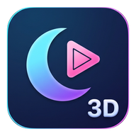

<p align="center">
  
</p>

<h1 align="center">Lumelight 3D</h1>

<p align="center">
  Moonlight-based 3D streaming for Leia lightfield panels<br>
  Leia Lume Pad 2 · Red Magic Tablet 3D Explorer Edition
</p>

<p align="center">
  <a href="#한국어">한국어</a> · <a href="#english">English</a>
</p>

---

## 한국어

[Artemis](https://github.com/ClassicOldSong/moonlight-android)(Moonlight Android 포크)에 나안 3D 출력을 붙인 앱입니다. PC 화면을 스트리밍하면서 태블릿에서 안경 없이 3D로 봅니다. Leia 라이트필드 패널을 쓰는 두 기기용 빌드가 있습니다.

| 빌드 | 대상 기기 | 패키지 | 기기의 CNSDK |
|---|---|---|---|
| Lume Pad 2 (`leiaLumepad`) | Leia Lume Pad 2 | `com.limelight.leia.noirdebug` | 0.8.20 |
| Red Magic (`leiaRedmagic`) | RedMagic Tablet 3D Explorer Edition (모델 `NP02J`, 코드네임 `K68`) | `com.limelight.leia.redmagic.noirdebug` | 0.10.x |

두 기기 모두 위빙 본체·위빙 셰이더·얼굴추적은 기기에 이미 설치된 Leia CNSDK가 하고, 앱에는 그 버전에 맞는 얇은 연결부만 들어갑니다. 두 빌드는 패키지가 달라서 한 기기에 함께 설치할 수 있습니다.

### 핵심 기능

**3D Source: 무엇을 3D로 만들지 고릅니다.** 설정 › 비디오 설정 › 3D Settings에서 호스트가 보내는 영상의 종류를 고릅니다.

- **Side by Side (host sends 3D)** — PC가 이미 SBS를 보낼 때(3D Vision, Geo-11, SBS 영상 등) 그대로 위빙합니다.
- **2D to 3D (panel converter)** — 일반 2D 화면을 **기기의 Leia NPU 변환기**로 3D로 만듭니다. 앱에 따로 들어 있는 AI 모델이 없고, MiDaS보다 깊이감이 훨씬 좋습니다.

스트림 중 메뉴의 **Toggle 3D**로 언제든 2D와 3D를 오갈 수 있습니다. **Start Streams in 3D**를 켜면 연결되자마자 3D로 시작합니다. 권장 설정: **3D Output = Glasses-Free 3D**.

- **스트림은 선명하게, 변환은 가볍게.** 스트림은 패널 해상도(2560×1600) 그대로 받습니다. 변환기에는 패널이 한 눈에 보여줄 수 있는 크기(1920×1200)까지만 넘깁니다. 이미 넘긴 프레임은 다시 넘기지 않습니다. 그래서 변환 속도가 들어오는 프레임을 따라갑니다.
- **3D Effect Strength**로 2D→3D의 깊이 강도를 조절합니다. 가운데 값이 Leia 기본값이고, 끝까지 올리면 두 배입니다. 초점(수렴)은 장면마다 자동으로 잡습니다.
- **밝기.** 3D에서는 화면을 최대 밝기로 올리고, 3D를 끄면 원래 밝기로 돌립니다. 이 패널들은 3D를 나와도 밝게 남는 일이 있어서, 앱이 시스템 밝기를 한 번 다시 써 넣습니다. 처음 3D를 켤 때 **「시스템 설정 수정」 권한**을 한 번 묻습니다. 밝기에만 쓰며, 허용하지 않아도 3D는 됩니다.
- **얼굴추적 안정성.** 얼굴을 잠깐 놓쳐도 3D가 풀리지 않습니다. 홈에 나갔다 돌아와도 추적이 다시 붙습니다.
- **화면 비율.** 16:9 스트림은 16:10 패널에서 늘어나지 않고 위아래에 띠가 생깁니다. SBS는 패널 전체로 펴집니다. 세로로 들고 시작해도 비율이 틀어지지 않습니다.
- 비디오 설정에 **3D Settings** 그룹이 따로 있습니다. 해상도·FPS·비트레이트 · 3D Settings · 고급 순서입니다.
- 커스텀 해상도에 입력한 값이 실제 스트림 해상도로 적용됩니다.

Red Magic 기기별 특이사항은 [docs/red-magic-3d-explorer.md](docs/red-magic-3d-explorer.md)에 정리돼 있습니다.

### 설치

APK를 배포하지 않습니다. Leia CNSDK가 들어가야 하는데, CNSDK는 Leia의 독점 SDK라 재배포할 수 없습니다. 아래처럼 자신의 기기에서 CNSDK를 준비해서 직접 빌드하세요.

### 직접 빌드

필요한 것: JDK 17, Android SDK와 NDK, `git submodule update --init --recursive`.

- **경로에 공백이 없어야 합니다.** NDK 빌드가 공백이 있는 경로를 처리하지 못합니다. 프로젝트가 공백이 있는 경로에 있으면 공백 없는 경로로 junction(심볼릭 링크)을 만들어 거기서 빌드하세요.
- **기기별 CNSDK 연결부가 필요합니다.** 저장소에는 들어 있지 않습니다(`.gitignore`로 막혀 있습니다). 두 기기의 CNSDK 코어 버전이 달라(Lume Pad 2는 0.8.20, Red Magic은 0.10.x) 연결부도 따로 준비해야 합니다.

  ```
  app/libs/leia-cnsdk.jar                                   (Lume Pad 2용, 0.8.20)
  app/src/leiaLumepad/jniLibs/arm64-v8a/libleiaSDK-jni.so
  app/src/leiaLumepad/jniLibs/arm64-v8a/libleiaCore-loader.so
  app/src/leiaLumepad/assets/cnsdk.version

  app/libs/redmagic/leia-cnsdk.jar                          (Red Magic용, 0.10.x)
  app/src/leiaRedmagic/jniLibs/arm64-v8a/libleiaSDK-jni.so
  app/src/leiaRedmagic/jniLibs/arm64-v8a/libleiaCore-loader.so
  app/src/leiaRedmagic/assets/cnsdk.version
  ```

  기기에는 Leia 시스템 앱(`com.leialoft.display.config`, `com.leia.headtrackingservice`, `com.leiainc.media.service`)이 있어야 합니다. 두 기기 모두 기본으로 들어 있습니다.

```
./gradlew assembleNonRoot_gameLeiaLumepadDebug    # Lume Pad 2
./gradlew assembleNonRoot_gameLeiaRedmagicDebug   # Red Magic
```

APK는 `app/build/outputs/apk/nonRoot_gameLeiaLumepad/debug/`, `app/build/outputs/apk/nonRoot_gameLeiaRedmagic/debug/`에 나옵니다.

CNSDK 연동에서 막혔던 곳, 실제 API, 증상별 원인은 [docs/lume-pad-2-cnsdk-notes.md](docs/lume-pad-2-cnsdk-notes.md)에 정리돼 있습니다.

### 알려진 문제

- **3D Convergence · 3D Eye Balance · Swap Left/Right Eye** 는 아무 동작도 하지 않습니다. 변환기는 초점을 장면마다 알아서 잡고, SBS 모드에서는 CNSDK가 좌우를 직접 가르기 때문입니다.
- Leia 3D 앱은 **한 번에 하나만** 띄우세요. 다른 3D 앱이 카메라를 쥐고 있으면 얼굴추적이 붙지 않아 평면으로 보입니다.

---

## English

An [Artemis](https://github.com/ClassicOldSong/moonlight-android) (Moonlight Android fork) build with glasses-free 3D output for Leia lightfield panels. Stream your PC and watch it in 3D on the tablet, no glasses. There are two device-specific builds.

| Build | Device | Package | Device's CNSDK |
|---|---|---|---|
| Lume Pad 2 (`leiaLumepad`) | Leia Lume Pad 2 | `com.limelight.leia.noirdebug` | 0.8.20 |
| Red Magic (`leiaRedmagic`) | RedMagic Tablet 3D Explorer Edition (model `NP02J`, codename `K68`) | `com.limelight.leia.redmagic.noirdebug` | 0.10.x |

On both, the weaving core, the weaving shader and face tracking are done by the CNSDK already installed on the device; the app carries only a thin connector matching that version. The two builds have different package names, so both can be installed on one device.

### Key features

**3D Source.** In Settings › Video Settings › 3D Settings, pick what kind of picture the host is sending.

- **Side by Side (host sends 3D)** — when the PC already sends SBS (3D Vision, Geo-11, SBS video), it is woven as it arrives.
- **2D to 3D (panel converter)** — ordinary 2D is turned into 3D by the **device's Leia NPU converter**. The app carries no AI model of its own, and the depth is much better than MiDaS.

**Toggle 3D** in the in-stream menu switches between 2D and 3D at any time. With **Start Streams in 3D** on, a stream starts in 3D as soon as it connects. Recommended: **3D Output = Glasses-Free 3D**.

- **Sharp stream, light conversion.** The stream arrives at the panel's full resolution (2560×1600). The converter is only fed what the panel can show per eye (1920×1200), and a frame it has already been given is not sent again. That lets the conversion keep pace with the incoming frames.
- **3D Effect Strength** sets the depth of 2D→3D. The middle is Leia's default; all the way up is double. Convergence is set automatically, scene by scene.
- **Brightness.** The screen goes to full brightness in 3D and back to your brightness when 3D ends. These panels can stay bright after leaving 3D, so the app writes the system brightness once more to bring it back. The first time 3D starts, it asks once for the **Modify system settings** permission. It is used only for brightness, and 3D works without it.
- **Face tracking that holds.** Losing your face for a moment no longer drops out of 3D, and tracking comes back after a trip to the home screen.
- **Aspect ratio.** A 16:9 stream is letterboxed on the 16:10 panel instead of stretched. SBS fills the whole panel. Starting in portrait no longer skews the picture.
- Video Settings has its own **3D Settings** group, in the order Resolution · FPS · Bitrate · 3D Settings · Advanced.
- A custom resolution you enter is the resolution actually streamed.

Red Magic-specific notes are in [docs/red-magic-3d-explorer.md](docs/red-magic-3d-explorer.md).

### Install

No APK is distributed. It needs Leia CNSDK, which is Leia's proprietary SDK and cannot be redistributed. Prepare CNSDK from your own device as below and build it yourself.

### Building

You need JDK 17, the Android SDK and NDK, and `git submodule update --init --recursive`.

- **The path must not contain spaces.** The NDK build cannot handle them. If the project sits under a path with spaces, create a junction (symbolic link) at a path without spaces and build from there.
- **You need a matching CNSDK connector per device.** Neither is in the repository (`.gitignore` blocks them). The two devices run different CNSDK core lines (0.8.20 on the Lume Pad 2, 0.10.x on Red Magic), so each needs its own connector:

  ```
  app/libs/leia-cnsdk.jar                                   (Lume Pad 2, 0.8.20)
  app/src/leiaLumepad/jniLibs/arm64-v8a/libleiaSDK-jni.so
  app/src/leiaLumepad/jniLibs/arm64-v8a/libleiaCore-loader.so
  app/src/leiaLumepad/assets/cnsdk.version

  app/libs/redmagic/leia-cnsdk.jar                          (Red Magic, 0.10.x)
  app/src/leiaRedmagic/jniLibs/arm64-v8a/libleiaSDK-jni.so
  app/src/leiaRedmagic/jniLibs/arm64-v8a/libleiaCore-loader.so
  app/src/leiaRedmagic/assets/cnsdk.version
  ```

  The device needs the Leia system apps (`com.leialoft.display.config`, `com.leia.headtrackingservice`, `com.leiainc.media.service`). Both devices ship with all three.

```
./gradlew assembleNonRoot_gameLeiaLumepadDebug    # Lume Pad 2
./gradlew assembleNonRoot_gameLeiaRedmagicDebug   # Red Magic
```

The APKs land in `app/build/outputs/apk/nonRoot_gameLeiaLumepad/debug/` and `app/build/outputs/apk/nonRoot_gameLeiaRedmagic/debug/`.

Where the CNSDK integration got stuck, the real API and causes by symptom are written up (in Korean) in [docs/lume-pad-2-cnsdk-notes.md](docs/lume-pad-2-cnsdk-notes.md).

### Known issues

- **3D Convergence · 3D Eye Balance · Swap Left/Right Eye** do nothing. The converter sets convergence per scene, and in SBS mode CNSDK splits the eyes itself.
- Run **one** Leia 3D app at a time. If another 3D app holds the camera, face tracking cannot attach and the picture looks flat.

---

## Credits · License

- Based on [Artemis](https://github.com/ClassicOldSong/moonlight-android) by ClassicOldSong and [Moonlight](https://github.com/moonlight-stream/moonlight-android). Its original README is in [docs/artemis-upstream-readme.md](docs/artemis-upstream-readme.md).
- Licensed under GPL-3.0 ([LICENSE.txt](LICENSE.txt)).
- Leia CNSDK and the Leia media service belong to Leia Inc. and are **not included** in this repository.
